# Forever Memory

Everything your World of Warcraft: Forever characters live through, kept for
good: an armory, every step on the real map, fights, quests, the people you
met, and a diary your character writes (and reads aloud) themselves.

  
  
  
  

https://github.com/user-attachments/assets/155cfd52-e408-4c76-b37f-cc8a5c515874

## Getting started

1. Download the app for your system above and start it.
   - **macOS**: the app isn't notarized; the first time, right-click it and
     choose Open.
   - **Linux**: unpack it and run `forever-memory`; the `.desktop` file next
     to it adds it to your menu.
2. The app finds World of Warcraft on its own (Blizzard's usual folders on
   Windows and macOS; Wine, Lutris, Bottles and Steam prefixes on Linux). If
   it doesn't, pick the folder in Settings.
3. Click **Install the addon**. It is called *armory*, changes nothing in the
   game and sends nothing anywhere: it records into the game's saved
   variables. (Or install [`armory-addon.zip`](https://github.com/stockime/forever-memory-app/releases/latest/download/armory-addon.zip) by hand.)
4. Play. Whenever the game saves (on `/reload` and logout), the app records
   it into your archive and shows your characters.

The app speaks English, Deutsch, Français, Español, Português (Brasil) and
简体中文, following the game's language unless you pick one.

## What's in it

- **Overview**: leveling curve and gold against hours played, time per zone,
  XP per hour per session, open quests nearest to done.
- **Armory**: gear on the class scene with the game's tooltips and when each
  item was first acquired, the character sheet, both talent specs on their
  Classic backgrounds, Legacy trees.
- **Journal**: sessions sortable by date, length, experience, leveling speed,
  loot or deaths; each one as a feed of loot, money, XP, quests, places,
  deaths, NPCs and the chat going on at the time, with filters.
- **Diary**: a personality note per character, and for each day played an
  entry the character writes themselves: a first-person look back on the day's
  journey, from inside the world, written from that day's recorded facts by
  the agent CLI you already use (Claude Code, Codex, Gemini CLI or any
  command) or any OpenAI-compatible API, hosted or local (Ollama, LM Studio).
  The facts sit under each entry so every sentence can be checked. Other
  players' chat is never sent. `forever-memory diary <character> [YYYY-MM-DD]`
  writes one from the command line.
- **Narration**: each diary entry can be read aloud by ElevenLabs. Every
  character gets one voice, designed once in the style of their race and
  gender in the game (a raspy Forsaken, a Scottish dwarf, …; designed from a
  description, not cloned from the game's actors), shaped by the personality
  note, with one seed per race and gender; its id is kept in the
  archive, so every entry sounds like the same person, in every language
  (each language gets its own voice). Optional; needs an ElevenLabs API key.
- **Quests**: active (with objective progress), completed and abandoned, with
  the full quest text, rewards offered and chosen, time taken, and how the
  objectives progressed.
- **Map**: the recorded path on the zone's Classic world map with quests,
  deaths and level-ups where they happened, and a replay scrubber. Only what
  the character has explored is revealed; the rest stays dark.
- **Combat**: fights and damage per second, abilities with crit rates, kills,
  and the ten seconds before every death, from the native combat logs.
- **Gold & loot**: where money comes from and goes, every item that went
  through the bags.
- **Players**: everyone met, searchable, with full names, class, race, level
  and guild once the addon has seen them up close (else a class guess from
  their spells), what passed between you, what they cast and what they said.
- **Fellowship and nemeses**: who each character travelled with, for how
  long, and what passed between them; who killed them, where, and whether
  they took their revenge.
- **Deeds**: class-specific feats earned from what was recorded (Hands of
  Mercy, Consecrated Ground, Payback…), each with the moment it was earned.
- **Item stories**: every item's life, from who dropped it to what replaced
  it, and the kills made while it was wielded.
- **The Chronicle**: a character's diary bound as a book, with chapters by
  zone and pages that turn.
- **Letters**: a player's characters write to each other in their own voices,
  about their days and what the account shares (mounts, companions, Legacy).
- **The Book of the Dead**: every death with its last ten seconds, and an
  epitaph written by the one who died.
- **"Previously on…"** for streamers: a page for an OBS browser source that
  reads the last diary entry aloud before the stream starts, with a
  countdown.
- Every race and class starts with a personality of its own for the diary,
  which you can make your own.

On start the app shows a loading screen (Forever's own continent art, a
progress bar, tips about your characters) until the logs are read and all game
art is painted, so pages never fill in piece by piece. Ctrl+K searches
quests, players and items from anywhere; F5 reloads. The app also reloads on
its own whenever the game saves.

## Settings

Everything works without setup; Settings lets you change:

- **World of Warcraft**: the install and game client folder, and the addon
  (installed and kept up to date from the app).
- **Language**: automatic (the game's, then the system's) or one of six.
  Diary entries are written and read aloud in it.
- **Who writes the diary**: automatic (the first agent CLI or API found), an
  agent CLI (Claude Code, Codex, Gemini CLI, or any command that reads a
  prompt on stdin), or an OpenAI-compatible API (OpenAI, OpenRouter, DeepSeek,
  Mistral, Ollama, LM Studio, … found from `OPENAI_API_KEY` and friends or
  running locally).
- **Reading the diary aloud**: your ElevenLabs API key.
- **The archive**: where recordings are kept (with full git history when git
  is installed), and whether finished chat and combat logs are moved out of
  the game folder between sessions.
- **Reading speed** of the diary, from 0.75× to 2×, right in the player.
- **Backup** (optional): S3-compatible object storage (AWS, Hetzner,
  Backblaze B2, Cloudflare R2, MinIO, …). The archive goes up as incremental
  git bundles, the native logs compressed. With object lock on the bucket the
  backup can't be altered.

Settings live in `settings.json` in your config folder
(`~/.config/forever-memory` on Linux, `~/Library/Application Support/forever-memory`
on macOS, `%APPDATA%\forever-memory` on Windows), readable only by you.

## Screenshots

Tom Crusader, a level 20 Undead Protection Paladin, and his alts are made-up demo characters (see `demo/`); no real account or player is shown.

**Overview**

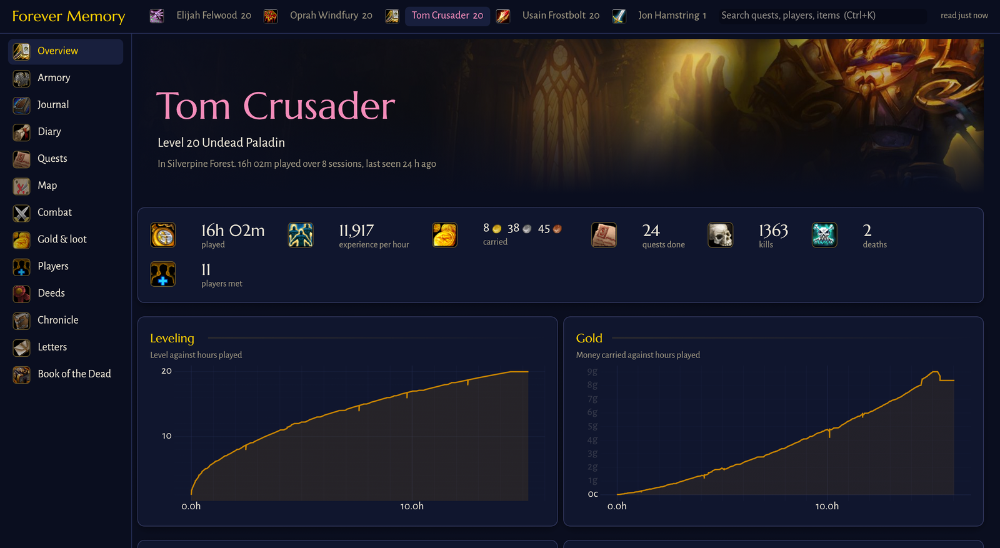

**Armory**

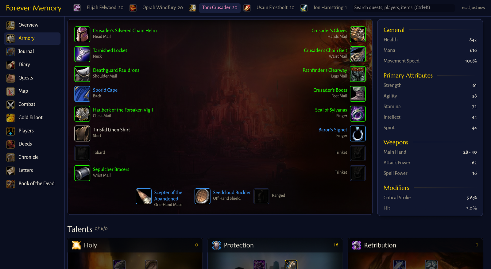

**Journal**

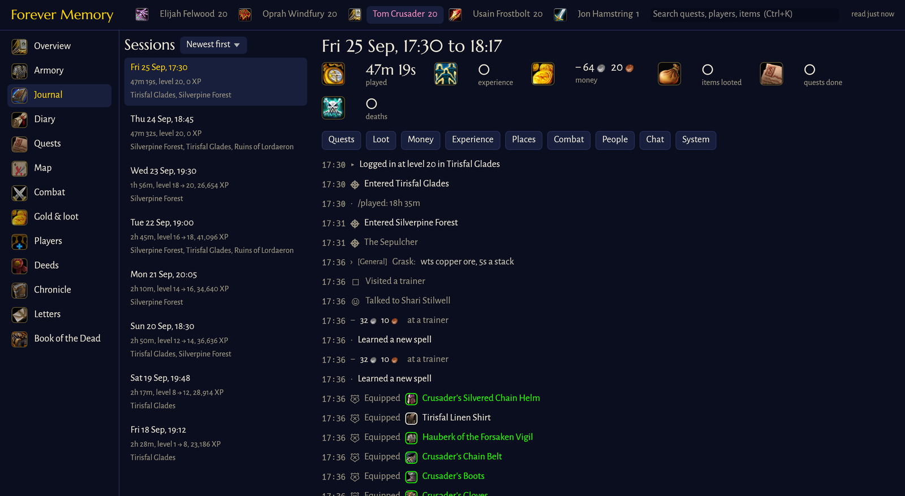

**Diary**

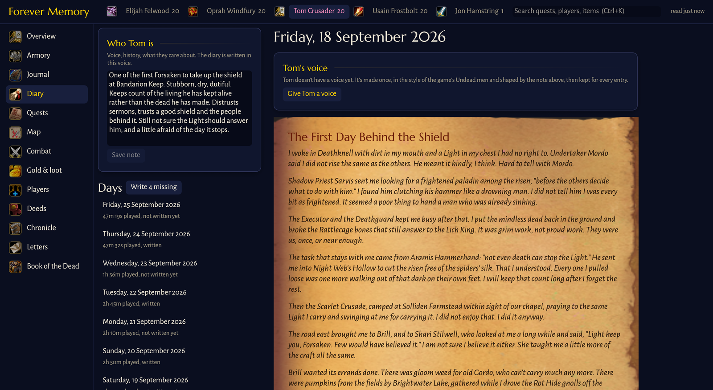

**Chronicle**

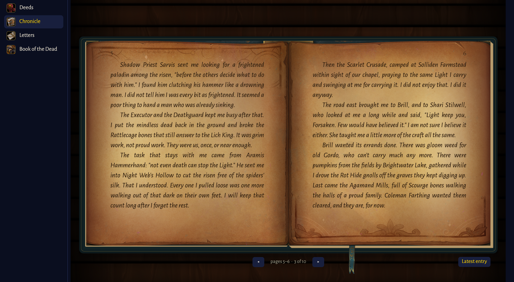

**Letters**

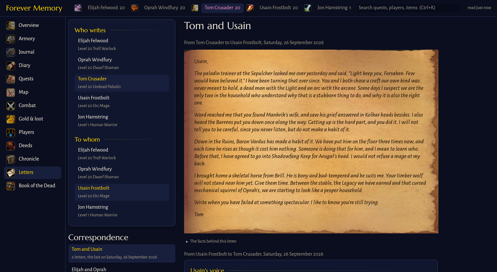

**Deeds**

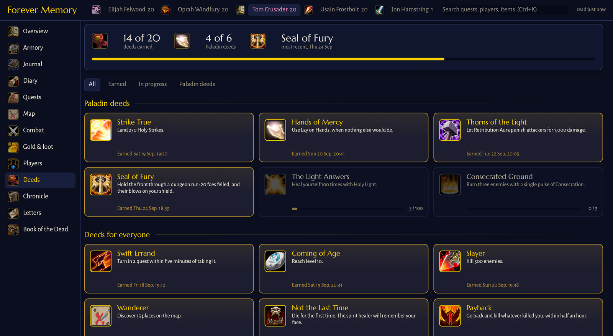

**Quests**

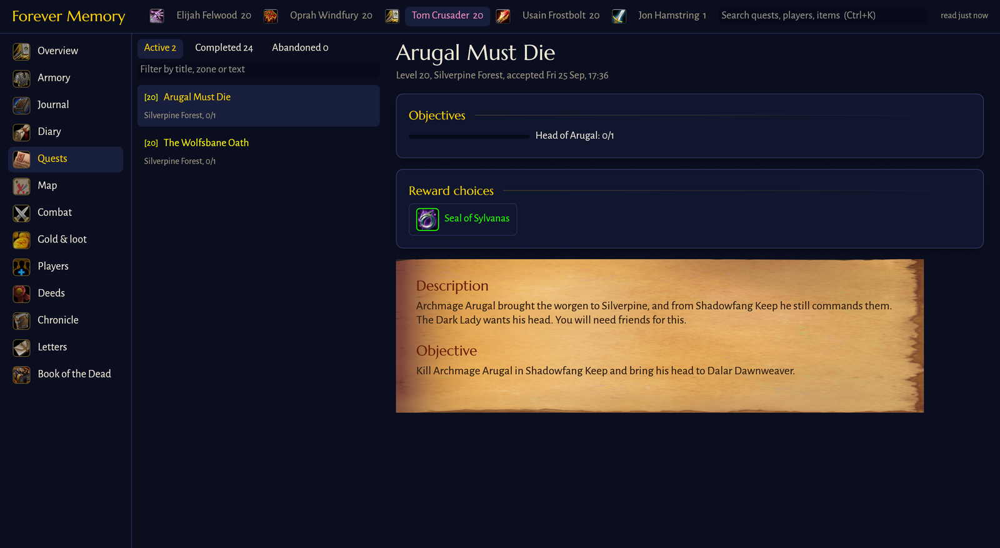

**Map**

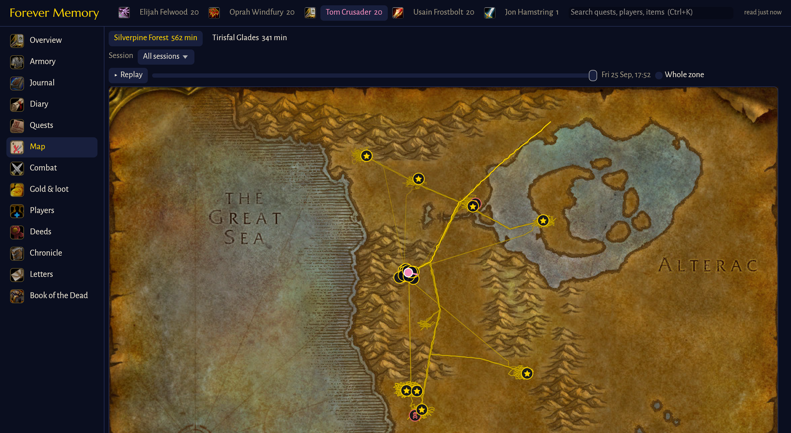

**Combat**

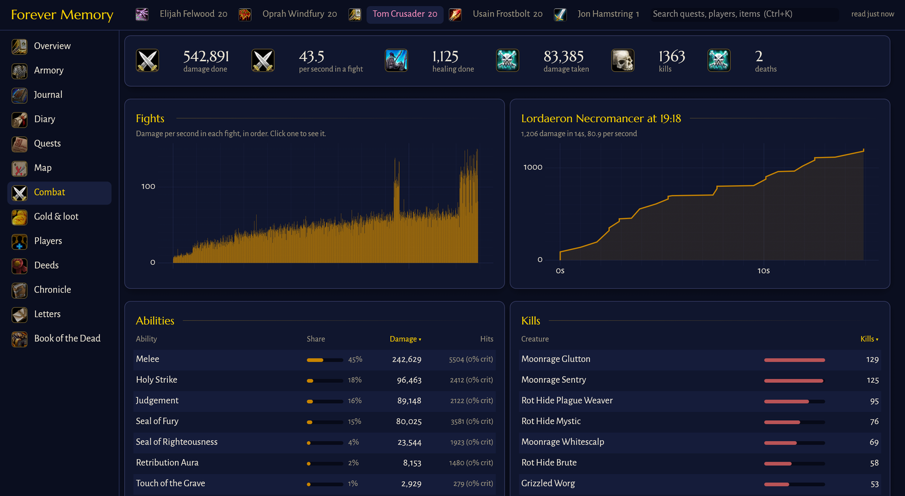

**Book of the Dead**

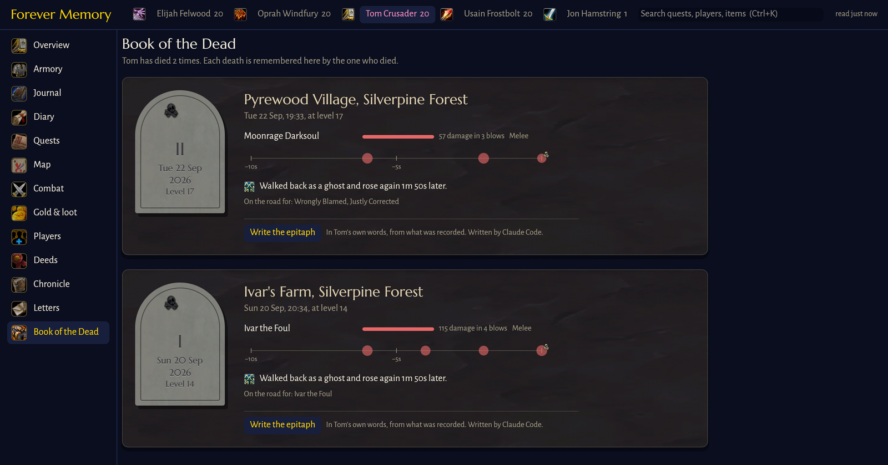

**Gold & loot**

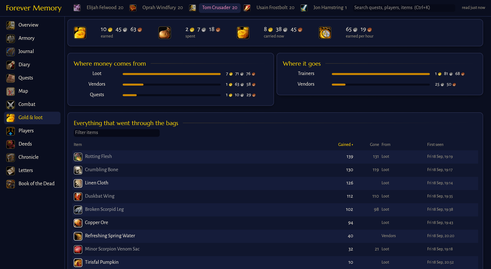

**Players**

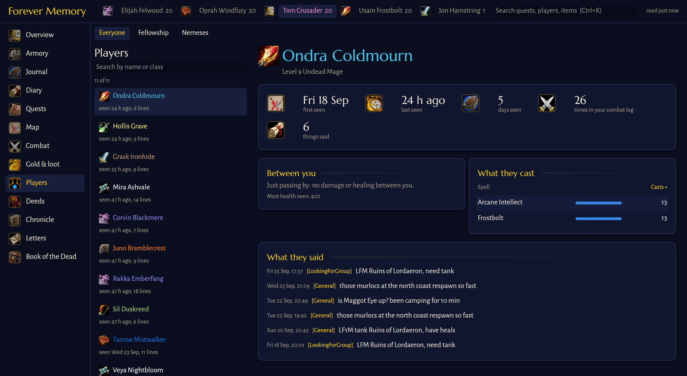

**Fellowship**

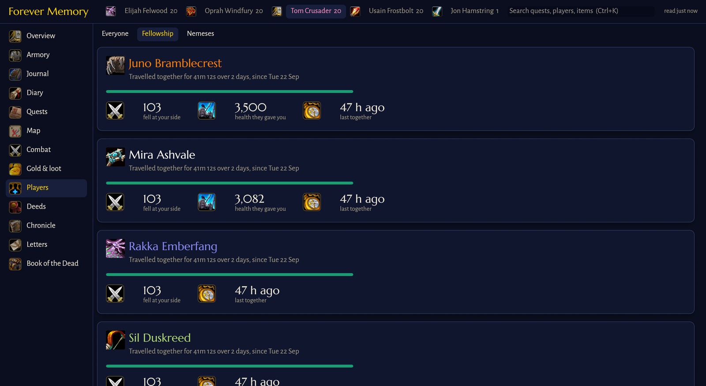

**Nemeses**

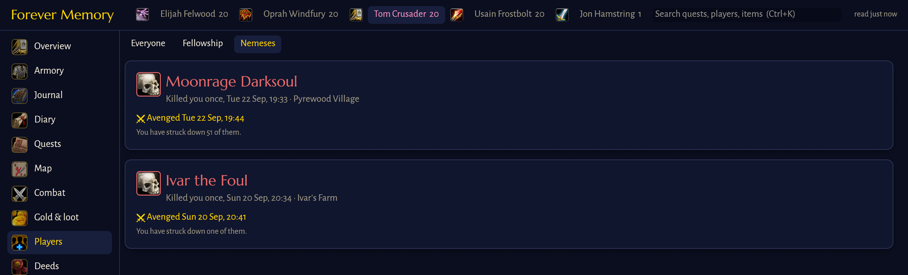

## Data

| What | Where |
|---|---|
| Archive | `forever-memory/archive` in your data folder, or the one you pick |
| Archived native logs | `forever-memory/logs` in your data folder, or the one you pick |
| Live native logs | the game client's `Logs/` folder |
| Game art | rendered from your game install on first use, cached in `forever-memory/art` in your cache folder |
| Narration | `forever-memory/audio` in your data folder |

The archive holds, per character, the armory snapshot, every recorded event
by day (`log/<date>.jsonl`), the quest log, when each item was first seen,
the diary and the voice; plus the item catalogue, quest texts, the players
met and a manifest of every native log. No game art is stored or shipped:
it is read from your own install.

## Build

    git clone --recursive https://github.com/stockime/forever-memory-app
    cargo build --release

The addon lives in its own repository,
[forever-memory-addon](https://github.com/stockime/forever-memory-addon),
included here as a submodule and built into the app.

To keep recording while the app is closed, run `forever-memory sync` in the
background (e.g. as a systemd user service or a login item); it uses the same
settings, and only one recorder works on an archive at a time.

Command line: `forever-memory record` archives the current saves once;
`forever-memory check-s3` checks the backup settings;
`forever-memory diary <character> [YYYY-MM-DD]` writes a diary entry;
`FM_SHOT=out.png FM_PAGE=quests forever-memory` saves a screenshot of a page
and quits (used to check layouts), `FM_LANG=de` picks a language for it.

Releases are built by GitHub Actions for Linux, macOS (universal) and
Windows when a `v*` tag is pushed.

## License

MIT, see [LICENSE](LICENSE). World of Warcraft and its art belong to
Blizzard Entertainment; the app ships none of it and reads the art from your
own game install.
